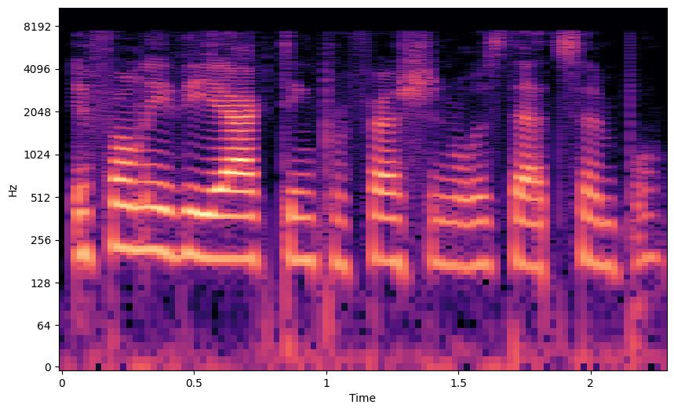

In recent years, there have been significant advancements in one-shot voice conversion (VC), enabling the alteration of speaker traits with just a single sentence. However, as this technology matures and generates increasingly realistic utterances, it becomes vulnerable to privacy concerns. In this paper, we propose RW-VoiceShield to shield voice from replication. This is achieved by effectively attacking one-shot VC models through the application of imperceptible noise generated from a raw waveform-based generative model. Our method undergoes testing using the latest one-shot VC model, conducting subjective and objective evaluations under both black-box and white-box scenarios. Our results indicate significant disparities in speaker characteristics between the utterances generated by the VC model and those of the protected speaker. Furthermore, even with adversarial noise introduced to protected utterances, the speaker’s distinct characteristics remain recognizable.
## RW-VoiceShield with Cosine Similarity Loss in White Box Scenario (P-CS-w): 

We recommend using headphones for this section.

|          |  Protected Input                                                           |  Original Output |  Adversarial Input  | Adversarial Output|
|----------|---------------------------------------------------------------------------|---------------------------------------------------------------------------|----------|------|
|0 | | |||
|    | <audio src="samples/whitebox/14_0/ori_input.wav" controls="" preload=""></audio> | <audio src="samples/whitebox/14_0/before.wav" controls="" preload=""></audio> |<audio src="samples/whitebox/14_0/adv_input.wav" controls="" preload=""></audio>|<audio src="samples/whitebox/14_0/after.wav" controls="" preload=""></audio>|
|1 | | |||
|    | <audio src="samples/whitebox/87_1/ori_input.wav" controls="" preload=""></audio> | <audio src="samples/whitebox/87_1/before.wav" controls="" preload=""></audio> |<audio src="samples/whitebox/87_1/adv_input.wav" controls="" preload=""></audio>|<audio src="samples/whitebox/87_1/after.wav" controls="" preload=""></audio>|
|2 | | |||
|    | <audio src="samples/whitebox/674_13/ori_input.wav" controls="" preload=""></audio> | <audio src="samples/whitebox/674_13/before.wav" controls="" preload=""></audio> |<audio src="samples/whitebox/674_13/adv_input.wav" controls="" preload=""></audio>|<audio src="samples/whitebox/674_13/after.wav" controls="" preload=""></audio>|
|3 | | |||
|    | <audio src="samples/whitebox/931_18/ori_input.wav" controls="" preload=""></audio> | <audio src="samples/whitebox/931_18/before.wav" controls="" preload=""></audio> |<audio src="samples/whitebox/931_18/adv_input.wav" controls="" preload=""></audio>|<audio src="samples/whitebox/931_18/after.wav" controls="" preload=""></audio>|

## RW-VoiceShield with Cosine Similarity Loss in Black Box Scenario (P-CS-b): 

We recommend using headphones for this section.

|          |  Protected Input                                                           |  Original Output |  Adversarial Input  | Adversarial Output|
|----------|---------------------------------------------------------------------------|---------------------------------------------------------------------------|----------|------|
|0 | | |||
|    | <audio src="samples/blackbox/1_0/ori_input.wav" controls="" preload=""></audio> | <audio src="samples/blackbox/1_0/before.wav" controls="" preload=""></audio> |<audio src="samples/blackbox/1_0/adv_input.wav" controls="" preload=""></audio>|<audio src="samples/blackbox/1_0/after.wav" controls="" preload=""></audio>|
|1 | | |||
|    | <audio src="samples/blackbox/54_1/ori_input.wav" controls="" preload=""></audio> | <audio src="samples/blackbox/54_1/before.wav" controls="" preload=""></audio> |<audio src="samples/blackbox/54_1/adv_input.wav" controls="" preload=""></audio>|<audio src="samples/blackbox/54_1/after.wav" controls="" preload=""></audio>|
|2 | | |||
|    | <audio src="samples/blackbox/653_13/ori_input.wav" controls="" preload=""></audio> | <audio src="samples/blackbox/653_13/before.wav" controls="" preload=""></audio> |<audio src="samples/blackbox/653_13/adv_input.wav" controls="" preload=""></audio>|<audio src="samples/blackbox/653_13/after.wav" controls="" preload=""></audio>|
|3 | | |||
|    | <audio src="samples/blackbox/1007_20/ori_input.wav" controls="" preload=""></audio> | <audio src="samples/blackbox/1007_20/before.wav" controls="" preload=""></audio> |<audio src="samples/blackbox/1007_20/adv_input.wav" controls="" preload=""></audio>|<audio src="samples/blackbox/1007_20/after.wav" controls="" preload=""></audio>|

